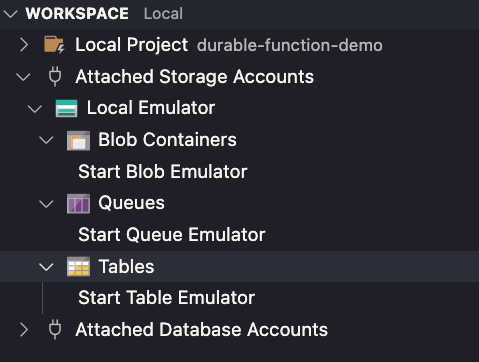

# Durable Function Demo

This repository highlights aspects of Azure durable functions, particularly clients (HTTP clients in this case), orchestrators, activity durable functions, entity durable functions and activity function retry.

## Running locally

To run this project locally using VS Code, install the [Azure Tools extension](https://code.visualstudio.com/docs/azure/extensions) and run the local Azure storage emulator for the following:

- Blob containers
- Queues
- Tables

Using the exported Postman collection (found [here](.ref/postman/)), run the three client HTTP endpoints to demo various aspects of durable functions.

### Client descriptions

#### Star Wars API

The Star Wars API demonstrates the scenario where an orchestrator calls multiple activity functions, in this case CreatePerson and CreateVehicle, using the fan-in, fan-out pattern. Additionally, the orchestrator calls an entity function, to track the count of characters created in our universe.

#### Counter API

The counter API is used to query the Counter entity, which is used to track the state of how many characters have been created in our Star Wars universe.

#### Flaky API

The flaky API demonstrates how to implement retry options when calling an activity function from an orchestrator.
